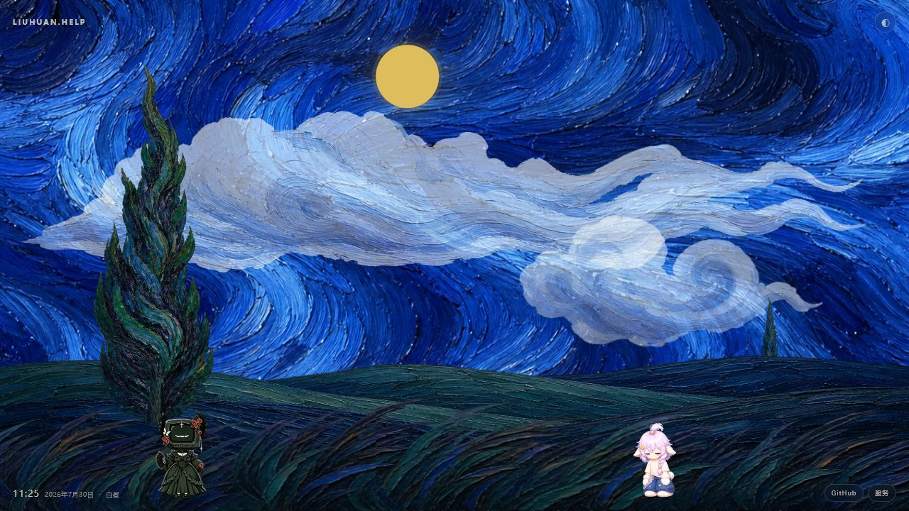

# StarrySky

一幅随浏览器本地时间变化的油画场景，以及两只由 JSON 动作清单驱动的桌面宠物。
(One day, I asked ChatGPT to build it. The rest is history.)

## 在线效果

**[打开 liuhuan.help 体验 StarrySky →](https://liuhuan.help/)**

[](https://liuhuan.help/)

## 组成

- `ambient-scene`：晨、昼、暮、夜切换，太阳轨迹、月相、云、树、草与轻微视差。
- `pet-world`：读取宠物 JSON 与 spritesheet，支持自动待机、随机动作、短距离游走、点击互动和拖动落地。
- `service-drawer`：默认收起的服务与连接入口。
- 原生 Web Components、CSS 与 Canvas，无前端框架和运行时依赖。

## 本地预览

请通过 HTTP 服务打开，避免浏览器对 ES Modules 和本地资源的限制：

```bash
python -m http.server 8080
```

然后访问 `http://127.0.0.1:8080/`。

## 宠物动作

动作、帧序列、循环方式、随机权重和左右移动绑定均位于：

- `assets/pets/noirrose/pet.json`
- `assets/pets/miemieyan/pet.json`

页面中的宠物单击后随机播放一个非移动动作；拖动超过阈值时只移动和落地，不触发点击动作。

## 许可

除下列两只宠物外，本仓库的代码、页面与美术资源采用 [MIT License](./LICENSE)，允许使用、复制、修改、发布、分发、再许可及商业使用：

- `assets/pets/noirrose/**`（NoirRose）
- `assets/pets/miemieyan/**`（MieMieYan）

上述两个宠物目录及其角色形象、动画、配置和衍生素材不适用 MIT License，未经明确书面授权不得提取、修改、再发布、制作衍生作品或用于商业用途。完整条款见 [宠物素材许可说明](./assets/pets/LICENSE.md)。
